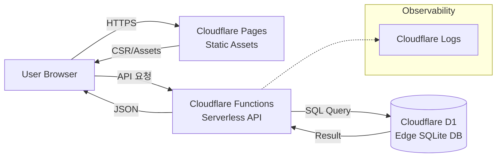

# EcoChaser

> **"복잡한 환경 정보를 게이미피케이션으로 풀어낸 Full-stack Serverless 프로젝트"**
> - **주요 성과:** 2025 캡스톤 경진대회 우수상 및 현장 투표 1위
> - **핵심 기술:** Cloudflare(Pages, Functions, D1), Node.js, Express
> - **Focus:** 서버리스 아키텍처를 통한 인프라 최적화 및 대규모 사용자 실시간 데이터 처리

## 1. 프로젝트 개요 (Engineering Summary)

EcoChaser는 “분리수거 정보가 복잡해서 참여가 낮아지는 문제”를 **러너형 게임 UX**로 재해석한 친환경 서비스입니다. 단순한 프론트 배포가 아니라 **Cloudflare Pages + Functions + D1을 결합한 Full-stack Serverless 아키텍처**로 설계하여, 인프라 운영 부담을 최소화하면서도 **실시간 랭킹/오답 노트**와 같은 동적 기능을 안정적으로 제공합니다.

핵심 목표는 다음 3가지입니다.

- **사용자 경험(UX)**: 텍스트 중심의 정보를 게임 흐름(가이드 → 플레이 → 결과)으로 전환
- **운영/확장성**: Serverless 기반으로 배포·확장 비용을 줄이고 장애 대응을 빠르게
- **실시간 데이터 처리**: Edge DB 기반으로 랭킹 집계/조회 지연을 최소화

## 2. Live & Repo

- **Demo:** https://eco-chaser.pages.dev/
- **GitHub:** https://github.com/ih148199-art/Eco_Chaser

## 3. Architecture

## 4. 기술 스택 (구체화/복붙용)

### Cloudflare Ecosystem

단순 배포를 넘어 **Pages(정적 자산) + Functions(API) + D1(DB)** 를 결합해 **Full-stack 파이프라인**을 구성했습니다. 서버·DB 인프라를 별도로 운영하지 않아도 되는 구조로 전환하여 **인프라 관리 비용을 최소화**하고, 배포/확장/장애 대응을 빠르게 가져갈 수 있도록 설계했습니다.

### Cloudflare D1

SQLite 기반의 **Edge Database**인 D1을 활용해, 전 세계 어디서든 지연 시간을 최소화하는 방향으로 **실시간 랭킹 시스템**을 구현했습니다. 랭킹 조회/집계의 병목을 줄이기 위해 쿼리 구조를 점검하고 인덱싱 전략을 고려하여 응답 시간을 최적화했습니다.

### Node.js & Express

Serverless 환경에서 유지보수성을 확보하기 위해 **Express 스타일의 라우팅 구조**를 설계했습니다. 엔드포인트를 명확히 분리하고 미들웨어 패턴을 활용해 로직을 모듈화하여, 기능 추가/수정 시 변경 범위를 최소화하도록 구성했습니다.

## 5. Technical Troubleshooting (가장 중요)

### 문제

서버리스 환경에서 랭킹 데이터를 집계/조회할 때, 사용자 수가 증가하면 **응답 지연(latency)** 이 발생할 수 있었습니다. 특히 “랭킹”은 사용자 체감이 큰 기능이라, 시연 환경에서 안정성이 중요했습니다.

### 분석

원인을 쿼리 관점에서 분해해보니, **D1 쿼리 최적화 및 인덱싱 필요성**이 핵심 이슈였습니다.

- 랭킹 집계 쿼리에서 불필요한 스캔이 발생할 수 있음
- 조회/정렬 조건에 맞는 인덱스가 없으면 응답 시간이 사용자 수에 비례해 증가

### 해결

다음과 같은 방향으로 응답 속도를 최적화했습니다.

- **효율적인 SQL 쿼리 설계**: 필요한 컬럼만 조회하고, 집계/정렬/필터 조건을 단순화
- **인덱싱 전략**: 조회 패턴에 맞춰 인덱스 적용을 검토하여 전체 스캔을 최소화
- **캐싱 전략 고려**: 서버리스 특성을 고려해 “자주 조회되는 랭킹”은 캐싱 가능성을 열어두고 설계

### 결과

캡스톤 경진대회 현장에서 **100명 이상 동시 접속** 상황에서도, 랭킹/오답 노트 포함 주요 기능을 **끊김 없이 제공**했습니다.

## 6. 성과 및 증빙 (업그레이드)

### 주요 성과

- **2025 캡스톤 디자인 경진대회 우수상 수상**
- **현장 투표 1위 달성**

### 개발자로서의 임팩트

- 텍스트 중심의 분리수거 정보를 **러너형 게임 UX**로 재해석하여 사용자 참여 흐름을 강화
- Serverless 로그 모니터링 기반으로 시연 중 발생한 예외 상황을 빠르게 파악하고 대응
- Full-stack Serverless 구조로 운영 부담을 줄이면서도 핵심 기능(랭킹/오답 노트)을 안정적으로 제공

### 증빙 자료

아래 경로에 캡스톤 관련 증빙 이미지가 포함되어 있습니다.

- `public/images/projects/ecochaser/`
  - 캡스톤 경진대회 우수상.jpg
  - 캡스톤 현장 결과 1.jpg
  - 캡스톤 현장 결과 2.jpg

